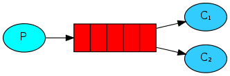

Tests of queueing using Python and RabbitMQ following [this](https://www.rabbitmq.com/getstarted.html) tutorial.

**Hello world**

**Work queues**

**Publish/Subscribe**

**Routing**

**Topics**

**Remote Procedure Call (RPC)**

Commands
--------

List all queues:

    sudo rabbitmqctl list_queues

List all queues including unacknowledged messages

    sudo rabbitmqctl list_queues name messages_ready messages_unacknowledged

List exchanges:

    sudo rabbitmqctl list_exchanges

List bindings:

    sudo rabbitmqctl list_bindings.

Enable management dashboard:

    sudo rabbitmq-plugins enable rabbitmq_management

Access dashboard at http://localhost:15672/

Standard credentials for dashboard: user: guest, pass: guest.
